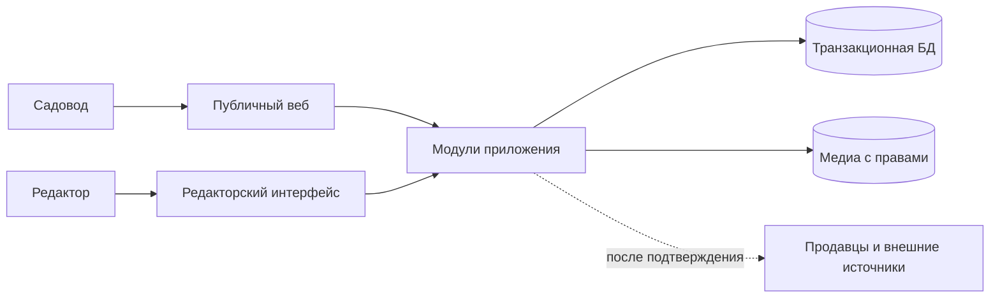

# Начальная архитектура

Статус: проектное предложение для `F-04`; окончательный стек не выбран. Архитектура должна поддерживать большой продукт без обязательной ранней сложности.

## Принципы

1. Публичные материалы и карточки доступны как содержательный HTML. Поиск, доступность и скорость проверяются на работающем сайте.
2. На старте границы предметных областей важнее границ процессов. Предлагаем один развёртываемый веб-продукт с внутренними модулями и явными интерфейсами.
3. Записи о сортах и фактах отделены от предложений продавцов и операций заказа. Данные публикуются через редакторский процесс.
4. Сложные компоненты вводятся после конкретного ограничения: времени ответа, объёма данных, независимого выпуска команды или отказоустойчивости.
5. Внешние API и источники находятся за адаптерами; отсутствие интеграции не должно ломать публичные справочные страницы.

## Предлагаемые модули первого выпуска

| Модуль | Ответственность | Что не смешивать |
| --- | --- | --- |
| Public Web | Страницы культур, сортов, руководств и подбора. | Логику происхождения фактов и остатки продавцов. |
| Catalog | Таксономия сортов, синонимы, свойства и версии публикации. | Товарные карточки конкретного продавца. |
| Evidence & Editorial | Источники, права на медиа, проверки, замечания и публикация. | Пользовательские клики как доказательство агрономии. |
| Recommendation | Объяснимые правила выбора, область применимости и неопределённость. | Точные обещания урожайности и автоматическое лечение. |
| Content | Руководства, авторы, версии, локальные страницы и связи с сортами. | Автоматическую публикацию невычитанных материалов. |
| Commerce (позже) | Продавцы, предложения, остатки, заказы и исполнение. | Биологическое описание сорта как источник цены/наличия. |
| User Garden (позже) | Посадки пользователя, календарь, согласия и уведомления. | Обязательную регистрацию для чтения справочника. |
| Telemetry | Минимальные события сценария, ошибки и показатели работы. | Сырые персональные данные без цели и срока хранения. |

## Предлагаемая схема взаимодействия

В первом кодовом срезе SQLite хранит источники, сорта, наблюдения и редакторские статусы. Rust CLI выполняет миграции и выпускает только публичный JSON, Rust/WASM обрабатывает проверенные региональные правила в браузере, а статический генератор выпускает индексируемый HTML. Разделение зафиксировано в [ADR 0003](adr/0003-rust-wasm-github-pages.md). Связи сортов пока моделируются в реляционной схеме; отдельная графовая БД требует доказанного запроса, который трудно или дорого реализовать иначе.

## Контракты данных и операций

- Публичный API/HTML использует опубликованные версии фактов. Черновики и спорные сведения не видны посетителю.
- У рекомендации есть входные условия, версия правил, объяснение, источники и признак нехватки данных.
- У предложения есть продавец, цена/валюта, дата проверки, условия доставки и статус актуальности.
- Внешние загрузки проходят валидацию и идемпотентное обновление; сырые данные не публикуются автоматически.
- Изменения с побочными эффектами проектируются с учётом повторных запросов, журналирования и восстановления.

## Развитие платформы

- Поиск: начать с доступных средств основной БД/индекса; выделить поисковый движок при измеренных ограничениях качества или скорости.
- Фоновые задачи: сначала простая очередь/планировщик; брокер событий вводить при фактической потребности в независимых потребителях и гарантиях доставки.
- Аналитика: сначала события, необходимые для решений; отдельное хранилище и BI — когда есть реальные объёмы и вопросы.
- Сервисы и оркестрация: выделять по ясной границе владения, нагрузке и эксплуатации. Kubernetes и Kafka не являются критериями «мегапродукта».
- Мобильные приложения и IoT: отдельные клиенты/контуры после доказанного сценария; серверные контракты должны допускать их подключение.

## Нефункциональные требования первого выпуска

Безопасное хранение секретов, резервное копирование данных, наблюдаемость ошибок, доступность с клавиатуры, мобильная производительность, воспроизводимая сборка и проверка права на медиа. Численные бюджеты скорости/нагрузки задаются после базового измерения и ожидаемой аудитории; гипотетический рост в 100 раз из исходного текста не является расчётной нагрузкой.
