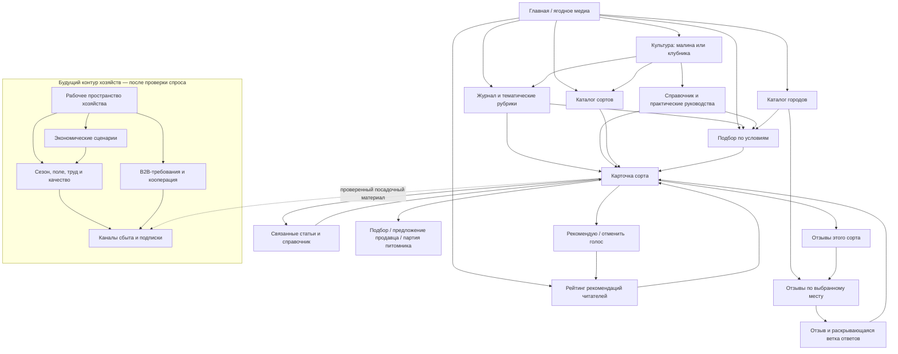
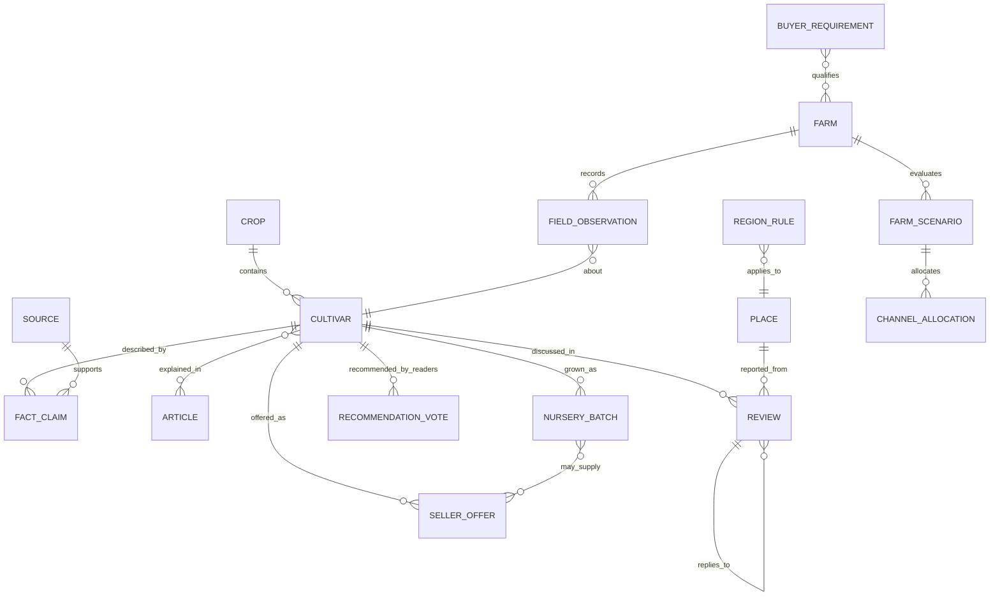

# Информационная архитектура MALINA

Это внутренняя карта продукта и переходов между задачами. Это не XML-карта для поисковых систем: технический `sitemap.xml` собирается отдельно из существующих URL.

## 1. Продуктовая рамка

MALINA развивается в двух связанных контурах:

1. **Ягодное медиа для садовода:** понять культуру → изучить сорта и источники → сравнить с условиями участка → увидеть опыт других людей → перейти к подтверждённому следующему шагу.
2. **Рабочая среда хозяйства:** оценить экономику → спланировать производство и риски → подтвердить сбыт → управлять урожаем и предложениями.

Первый контур — действующий продукт. Второй — направление развития, а не повод прямо сейчас строить набор пустых разделов. Контуры связываются через сорт, проверенные агрономические сведения, регион/место, предложение и фактическую партию.

## 2. Карта пользовательских путей

### Основные петли

- **Город → подбор → сорт → отзыв:** город — короткий путь в инструмент с предзаполненным местом. Подбор не обещает пригодность без региональных правил; карточка связывает проверенные признаки с обсуждениями сорта. Ссылка на отзывы из этого города доступна рядом как альтернативный путь.
- **Каталог → рекомендация → рейтинг → сорт:** один активный голос браузера за сорт с возможностью отмены. Рейтинг показывает популярность у читателей; проверенные признаки и региональная пригодность остаются отдельными данными.
- **Материал → решение:** статья ведёт к карточкам сортов, источникам и подбору; карточка возвращает к статьям, где объяснены критерии и ограничения.
- **Сорт → предложение:** сначала сорт и редакционные факты; отдельно — проверенное предложение продавца или подтверждённая собственная партия. Нет товара — нет цены, наличия или обещания продажи.
- **Хозяйство → сбыт:** хозяйство сначала фиксирует требования покупателя и каналы, затем проверяет производственный сценарий, ресурсы и качество. Расчёт — сценарий с явными допущениями, а не гарантия дохода.

## 3. Навигация и страницы

Навигация строится вокруг задач читателя. Основные пункты верхнего уровня: **Малина**, **Клубника**, **Сорта**, **Подбор**, **Журнал**, **Города**, **Отзывы**. Страница «О проекте» объясняет происхождение сведений, владельца и границы того, что уже проверено. Профессиональный вход для хозяйств появится, когда будет готов первый реально полезный инструмент.

| Задача | Текущий URL/раздел | Соседние переходы и роль |
| --- | --- | --- |
| Понять, что умеет сайт | `/` | Главный вход — подобрать сорт или открыть атлас; культуры, отзывы и журнал поддерживают выбор. |
| Разобраться в культуре | `/malina/`, `/klubnika/` | Сорта этой культуры, руководства, каталог и подбор. |
| Просмотреть сорта | `/sorta/` | Фильтры и карточка конкретного сорта. |
| Увидеть выбор читателей | `/rating/` | Рейтинг рекомендаций с фильтром культуры → карточка → отзывы; методика, дата агрегатов и отмена голоса. Сорта без голосов остаются без места. |
| Проверить один сорт | `/sorta/{slug}/` | Источники и границы фактов; отзывы под карточкой; связанные статьи; подбор; только подтверждённые предложения/партии. |
| Начать с условий участка | `/podbor/` или `/podbor/?city=…&region=…` | Подбор может открыться с городом и регионом из каталога; объяснимое сравнение → карточки сортов. Отсутствие подтверждённых региональных правил остаётся видимым. |
| Читать по теме | `/zhurnal/`, `/zhurnal/malina/`, `/zhurnal/klubnika/`, `/zhurnal/{article}/` | Рубрика, связанные материалы, сорта и подбор. |
| Подобрать для города | `/goroda/` → `/podbor/?city=…&region=…` | Основное действие каталога городов открывает подбор с заполненным местом; город сам по себе не является климатической рекомендацией. |
| Найти опыт рядом | `/goroda/` → `/otzyvy/?city=…&region=…` | Вторичное действие фильтрует отзывы по месту; из каждой карточки — к сорту. |
| Читать все обсуждения | `/otzyvy/` | Фильтры по месту; из отзыва — карточка сорта; ответы остаются в ветке родительского сообщения. |
| Проверить метод размножения | `/in-vitro/` | Объяснение метода и проверка документов конкретной партии; переход к руководствам о покупке посадочного материала. |
| Понять источники и проект | `/about/`, `/guide/` | Источники, редакционные ограничения, связанный сорт, культура или подбор. |
| Рассчитать дело хозяйства | Будущий раздел, URL не назначен | Сначала интервью и спецификация задачи; не публиковать пустой `/farm/` и не смешивать хозяйственные данные с публичным каталогом. |

URL будущих модулей выбираются при декомпозиции первой подтверждённой задачи. Не резервируем маршруты под идеи без владельца данных и сценария.

## 4. Сущности и смысл связей

- **Сорт** — биологическая/редакционная сущность. Он не является товаром и не содержит изменяющиеся цену или остаток.
- **Утверждение о сорте** хранится вместе с источником, датой, областью применимости и статусом проверки. В статье можно объяснить утверждение, но источник остаётся привязан к самому факту.
- **Место** — нормализованный город/регион для группировки опыта. Отзыв — наблюдение садовода, не полевое испытание и не доказательство региональной пригодности.
- **Отзыв** содержит корневую дискуссию, сорт, имя/псевдоним, место и текст. Ответы наследуют сорт обсуждения; отображение — раскрывающаяся ветка. Публично доступны только принятые сообщения. Сомнительная классификация сохраняется для ручной очереди.
- **Предложение продавца** и **собственная партия питомника** — разные сущности со сроком проверки, происхождением и условиями продажи. Сорт связывает их, но не наследует их наличие.
- **Расчёт хозяйства** — версия набора входных допущений и сценарного результата. Фактические наблюдения, замеры урожая, погодные показания и кадровые записи хранятся отдельно от расчёта и публичных отзывов.
- **География не одна:** место отзыва, регион агрономического правила, координаты участка/датчика и зона доставки имеют разные назначения и точность.

## 5. Модули профессионального контура

| Модуль | Что связывает | Решение о размещении |
| --- | --- | --- |
| Экономика хозяйства | Масштаб, тип выращивания, капитальные и текущие затраты, урожайность по фазам, горизонт окупаемости | Сценарии и диапазоны с источником каждого предположения; не обещает доходность. |
| Сбор и труд | Ожидаемый сбор по дням/фазам, выработка, смены, сдельная оплата, тара | Сначала агрегированные планы и стоимость. Персональные номера работников и сканирование лотков — отдельный закрытый операционный модуль после определения доступа, хранения и правового основания. |
| Переработка и Zero-Waste | Прогноз/факт урожая, доли каналов, мощность, выход продукции, цена и потери | Моделирует свежую ягоду, опт, IQF, пюре и другие направления только на проверяемых входных данных. Масло из семян и мука из жмыха требуют отдельной проверки технологического выхода и рынка. |
| Риск, погода и телеметрия | Регион/поле, погодные данные, фаза растения, датчики, сценарий уведомления | Календарь правил доступен отдельно от прямого управления устройствами. Датчик не запускает полив или защитную операцию без явного безопасного контура управления. |
| Сбор и охлаждение | Чек-лист сбора, время, тара, температура, партия и критерии качества | Контрольный журнал партии с прослеживаемостью; качество фиксируется наблюдением/измерением, а не значком без основания. |
| Сначала сбыт | Условия сети/HoReCa/завода, объём, упаковка, окно поставки, остаточный срок и требования к качеству | Аудит требований до закладки культуры; неизвестные условия покупателя отмечаются как пробел, а не предполагаются. |
| Кооперативы | Участники, прогноз/подтверждённый объём, единые характеристики, логистика и контракт | Пилот с несколькими реальными хозяйствами до агрегатора; общие партии не смешивают происхождение и качество. |
| D2C и бренд хозяйства | Подтверждённый ассортимент/партии, расписание поставки, контент и согласие клиента | Подписка открывается только при реальной способности исполнить график; редакционные публикации не маскируются под отзыв. |
| Эко-паспорт | Методики, записи производства, аудит/сертификаты, период действия | Публикует проверяемые факты и их срок/основание. Не делает зелёные заявления вроде «без химии» без доказательств и определения термина. |
| Атлас и защита растений | Сортовые признаки, механизация, плотность/плотность ягоды, вредитель/болезнь, метод санитарии, источники | Признаки с методикой и условиями испытаний; рекомендации по защите учитывают региональные регламенты, безопасность и компетентную проверку. |

## 6. Правила развития и доверия

1. Каждый экран отвечает на конкретную задачу и предлагает следующий релевантный шаг. Не добавляем страницу, если она не связана с сущностью, знанием или решением пользователя.
2. Отзыв и агрономический факт не взаимозаменяемы: пользовательский опыт показывает контекст, а не универсальную рекомендацию.
3. Любая рекомендация с региональной привязкой требует отдельного подтверждённого правила; фильтр города лишь находит опыт участников.
4. Денежный результат калькулятора сопровождается валютой, единицами, датой цен, диапазоном и разбором допущений. Изменение исходных данных не подменяет фактический отчёт.
5. Публичный медиа-контур хранит только необходимые для публикации сведения. Персональные данные работников, платежи, заказы и сенсорные ключи относятся к закрытым системам с разграничением доступа и сроков хранения; их не публикуют в статическом GitHub-репозитории.
6. Интеграции с прогнозом, метеостанцией, поставщиками и каналами продаж добавляются после проверки источника, разрешений, непрерывности и поведения при сбое.
7. Книжный тезаурус — редакционный справочник терминов и связей. Он помогает искать, но не заменяет проверку источника, современного контекста и прав на публикацию.

## 7. Очерёдность

1. **Сейчас:** развивать инструментальный путь каталога и подбора: город → предзаполненные условия → сорт → отзывы; рядом оставить просмотр местного опыта. Приоритизировать геонезависимый спрос на сорта и точечно исследовать региональные кластеры. Частоты и классификация — в [отчёте Wordstat](../research/wordstat/INTENTS-GEO-AND-DEMAND-2026-09.md).
2. **Затем:** расширять атлас и правила только с источниками; индексируемые региональные страницы запускать при достаточном отдельном спросе и уникальных региональных данных. Не клонировать города под малый точный спрос.
3. **Перед торговыми функциями:** проверить продавцов/партнёров, предложения и собственные партии; отделить информационные переходы от подтверждённого заказа.
4. **Профессиональные инструменты:** интервью с действующими ягодными хозяйствами; выбрать один расчёт с измеримыми исходными данными; пилотировать на реальном цикле; только после этого строить интеграционный комбайн и кооперацию.

Подробные задачи, статусы и условия старта модулей приведены в [BACKLOG.md](../BACKLOG.md). Исходная цель продукта зафиксирована в [PRODUCT_BRIEF.md](PRODUCT_BRIEF.md).
